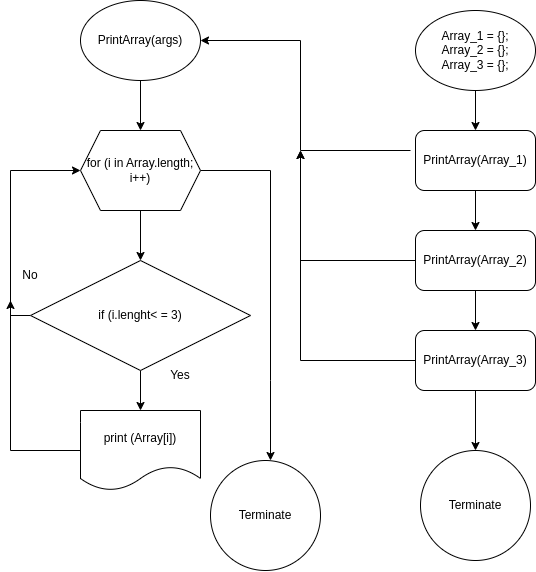

## Описание задачи 

*Задача на сортировку массива по длине строки* 

заданы массивы сток требуется отсортировать по условию и отрисовать результат в качестве ЯП использован C#

* сделан метод который принимаетна вход инициализированный массив;
* метод циклом перебирает значения в массиве;
* если длина строки соответствует заданному условию, то эти значения отображаются в консоле. 

реализация на javascript

    const someFunc = (array) => {
    array.forEach(item=> item.length <= 3 && console.log(item))
    }

    const arrayOne  =  ['hello', '2', 'world', ':-)'];
    const arrayTwo = ['1234', '1567', '-2'];
    const arrayThree = ['Russia', 'Denmark', 'Kazan'];
    
    someFunc(arrayOne)
    someFunc(arrayTwo)
    someFunc(arrayThree)
